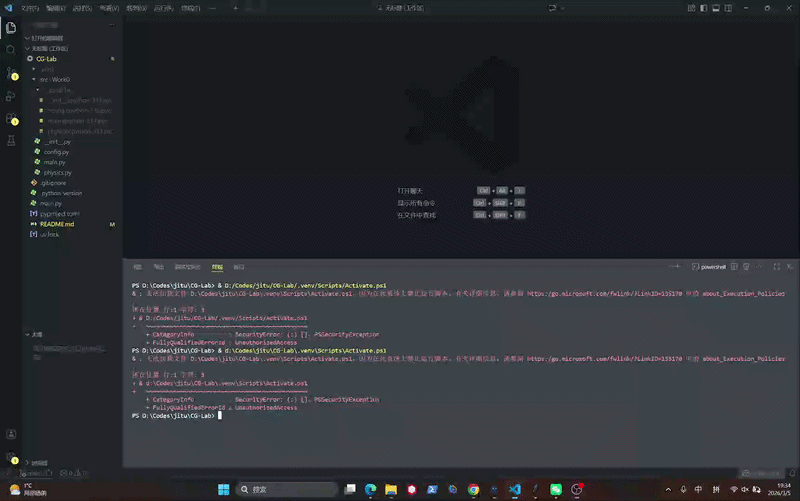

# CG-Lab

## Taichi GPU 万有引力粒子群仿真（基于 uv + src Layout）

---

## 📌 项目简介

本项目为计算机图形学实验项目，基于现代 Python 工程规范构建，使用：

* **VS Code** 作为开发环境
* **uv** 进行项目级虚拟环境管理
* **src 布局（Source Layout）** 进行工程解耦
* **Taichi** 实现 GPU 并行计算
* **Git** 进行版本控制

项目实现了一个基于万有引力模型的大规模粒子群并行仿真，并通过 GPU 加速进行实时渲染。

本实验打通完整开发链路：

> 环境隔离 → 工程结构设计 → GPU 并行计算 → 可视化渲染 → Git 版本管理

---

## 🚀 技术栈

* Python 3.x
* uv（Python 项目级环境管理工具）
* Taichi（高性能并行计算框架）
* VS Code
* Git

---

## 📂 项目结构（src Layout）

```
CG-Lab/
│
├── pyproject.toml        # 项目依赖管理文件
├── README.md             # 项目说明文档
├── .gitignore            # Git忽略文件
└── src/
    └── Work0/
        ├── __init__.py
        ├── config.py     # 参数配置层
        ├── physics.py    # GPU并行计算层
        └── main.py       # 渲染与程序入口
```

---

## 🧠 模块设计说明

### 1️⃣ config.py（参数层）

* 粒子数量
* 时间步长
* 引力常数
* 窗口大小
* 粒子半径

实现参数与逻辑分离，方便调试与扩展。

---

### 2️⃣ physics.py（计算层）

* 使用 Taichi `@ti.kernel` 编写并行计算
* 实现 N 体万有引力模拟
* 自动调用 GPU 后端
* 更新粒子速度与位置

该模块完全独立于界面层，实现逻辑解耦。

---

### 3️⃣ main.py（视图层）

* 创建 Taichi 窗口
* 调用 update() 进行物理更新
* 渲染粒子
* 控制主循环

---

## 🖥 运行方式

本项目使用模块化运行方式（src 布局规范）：

```bash
uv run -m src.Work0.main
```

⚠ 注意：不要使用

```bash
python main.py
```

否则会导致模块路径错误。

---

## ⚙ GPU 调用说明

程序启动后终端会输出硬件架构信息，例如：

```
[Taichi] Starting on architecture: cuda
```

常见成功调用情况：

* `cuda` —— NVIDIA 独立显卡
* `metal` —— Mac M 系列芯片
* `vulkan` —— 新版 Windows GPU
* `opengl` —— 旧版集成显卡

如果显示：

```
cpu
```

则说明未成功调用 GPU。

---

## 📊 功能特点

* 支持大规模粒子并行计算
* GPU 自动加速
* 实时物理模拟
* 模块化工程结构
* 项目级依赖隔离

---

## 🎥 运行效果展示

### 演示视频



---

## 🧩 环境搭建步骤

### 1️⃣ 安装 uv

```bash
pip install uv
```

### 2️⃣ 初始化项目

```bash
uv init
uv venv
uv add taichi
```

### 3️⃣ 运行项目

```bash
uv run -m src.Work0.main
```

---

## 📌 工程规范说明

本项目遵循以下规范：

* 使用 `.gitignore` 忽略 `.venv/`
* 采用 src 布局避免根目录污染
* 不上传虚拟环境
* 保持模块解耦设计

`.gitignore` 内容：

```
.venv/
__pycache__/
*.pyc
```

---

## 📖 实验收获

通过本实验掌握：

* 现代 Python 项目级环境隔离原理
* src 布局工程思想
* GPU 并行计算机制
* Taichi 基本使用方法
* Git 版本控制流程

---

## 🔮 可扩展方向

* 增加鼠标交互
* 加入边界碰撞检测
* 优化为 Barnes-Hut 算法（O(N log N)）
* 添加粒子颜色渐变
* 性能对比 GPU 与 CPU

---

## 📜 License

仅用于计算机图形学课程实验使用。

---

# ⭐ 项目完成状态

✔ 环境隔离
✔ src 布局重构
✔ GPU 并行计算
✔ 可视化粒子渲染
✔ Git 仓库管理

---

如需复现，请按照运行说明执行即可。
